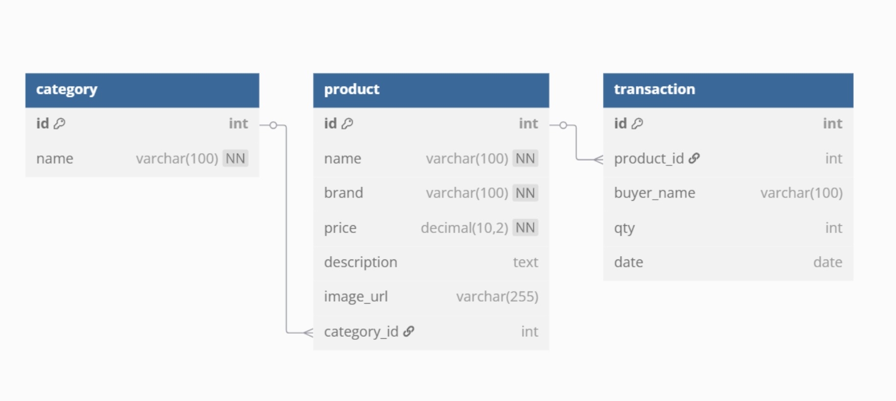

# TP7DPBO2025C1

## Janji
_Saya, **Hafsah Hamidah** dengan NIM **2311474**, mengerjakan **Tugas Praktikum 7** dalam mata kuliah **DPBO** dengan sebaik-baiknya demi keberkahan-Nya.  
Saya berjanji tidak melakukan kecurangan sebagaimana yang telah dispesifikasikan. **Aamiin.**_

## Deskripsi Program

Glowgether adalah aplikasi katalog produk kecantikan berbasis PHP dan PDO yang memungkinkan pengguna untuk melihat, menambah, mengedit, menghapus, serta mencari produk skincare, makeup, dan health product. Aplikasi ini terdiri dari tiga fitur utama: pengelolaan produk, kategori, dan transaksi pembelian.

## Fitur Utama

1. CRUD Produk – Tambah, edit, hapus, dan tampilkan produk lengkap dengan gambar dan kategori.
2. CRUD Kategori – Kelola daftar kategori produk.
3. CRUD Transaksi – Simpan riwayat pembelian produk oleh customer.
4. Search – Cari produk berdasarkan nama produk.
5. Relasi Database – Produk dan transaksi terhubung ke kategori dan produk secara langsung melalui Foreign Key.

## Alur Program

### Halaman Utama (index.php)

- Menampilkan navigasi untuk mengakses halaman Products, Categories, dan Transactions.
- Menyisipkan tampilan sesuai parameter page dan action.

### Produk

- Tabel produk dengan tombol Edit dan Delete.
- Tombol "+ Add Product" akan membuka form tambah produk.
- Search bar digunakan untuk mencari produk berdasarkan nama.
- Data produk ditampilkan lengkap dengan gambar, nama, brand, harga, deskripsi, dan kategori.

### Kategori

- Tabel semua kategori produk.
- Tombol "+ Add Category" akan menampilkan form untuk menambahkan kategori baru.

### Transaksi

- Tabel transaksi berisi nama customer, produk yang dibeli, jumlah, dan tanggal.
- Tombol "+ Add Transaction" untuk menambahkan transaksi baru.

## Struktur Database



Database: glowgether

Tabel `category`
- id (Primary Key)
- name

Tabel `product`
- id (Primary Key)
- name
- brand
- price
- description
- image_url
- category_id (Foreign Key ke `category.id`)

Tabel `transaction`
- id (Primary Key)
- product_id (Foreign Key ke `product.id`)
- buyer_name
- qty
- date

## ✅ Bukti Penggunaan PDO dan Prepared Statement

### Contoh di `Product.php`:
```php
$stmt = $this->db->prepare("SELECT * FROM product WHERE id = ?");
$stmt->execute([$id]);
```

### Contoh Insert:
```php
$stmt = $this->db->prepare("INSERT INTO product (name, brand, price, description, image_url, category_id) VALUES (?, ?, ?, ?, ?, ?)");
$stmt->execute([$name, $brand, $price, $description, $image_url, $category_id]);
```

### Contoh Update:
```php
$stmt = $this->db->prepare("UPDATE product SET name = ?, brand = ?, price = ?, description = ?, image_url = ?, category_id = ? WHERE id = ?");
$stmt->execute([...]);
```

## Modularisasi Project

Struktur folder glowgether:
```
/glowgether
│
├── class/
│   ├── Product.php
│   ├── Category.php
│   └── Transaction.php
│
├── config/
│   └── db.php
│
├── view/
│   ├── header.php
│   ├── footer.php
│   ├── product/
│   │   ├── index.php
│   │   └── form.php
│   ├── category/
│   │   ├── index.php
│   │   └── form.php
│   └── transaction/
│       ├── index.php
│       └── form.php
│
├── assets/
│   └── style.css
│
└── index.php
```

## Dokumentasi


https://github.com/user-attachments/assets/b03a0bb7-c70c-4baf-931e-7d7d0501e294


